**Thank you for choosing keyestudio!**

**We will endeavour to provide you with better products and services!**

------

**About keyestudio**

Keyestudio is the best-selling brand owned by KEYES Corporation. Our product contains Arduino development and expansion boards, sensors and modules, Raspberry Pi, micro:bit expansion boards as well as smart cars and learning kits, which can help customers at any level to learn about Arduino.

Notably, all of our products are in line with international quality standards and are greatly appreciated in a broad menu of different markets across the world.

Welcome to check out more contents from our official website:

<a href="http://www.keyestudio.com" target="_blank">http://www.keyestudio.com</a>

------

**Obtain Information and After-sales Service**

1. **Codes and tutorial download:** [https://fs.keyestudio.com/KS4048-KS4049](https://fs.keyestudio.com/KS4048)

2. If something is found missing or broken, or you have some difficulty learning the kit, please feel free to contact us. Welcome to send email to us: [service@keyestudio.com](http://m.138.gz.cn/webadmin/~CAmsnCrrNXhTAySKCerrIfWjjZuuWVfI/~/usr/mod_edituser.jsp?;uid=service@keyestudio.com;;clearCache=)

3. We will endeavour to update projects and products continuously from your sincere advice! Thanks!

------

**Warning**

1. This product contains tiny pin headers, so please keep out of reach of children under 7 to prevent from lacerations. 
2. This product also contains conductive parts(control board and electronic modules). Please operate according to the requirements of tutorials. Otherwise, improper operation may damage parts due to overheating. In this case, do not touch it and immediately disconnect the circuit power.

------

**Copyright**

The Keyestudio trademark and logo are the copyright of **KEYES DIY ROBOT co.,LTD**. All products under Keyestudio brand can’t be copied, sold or resold without authorization by anyone or any company. If you are interested in our products, please contact to our sales representatives: [fennie@keyestudio.com](http://m.138.gz.cn/webadmin/~CAmsnCrrNXhTAySKCerrIfWjjZuuWVfI/~/usr/mod_edituser.jsp?;uid=fennie@keyestudio.com;;clearCache=)

---

# Keyestudio microbit V2 Smart home Kit without Main board

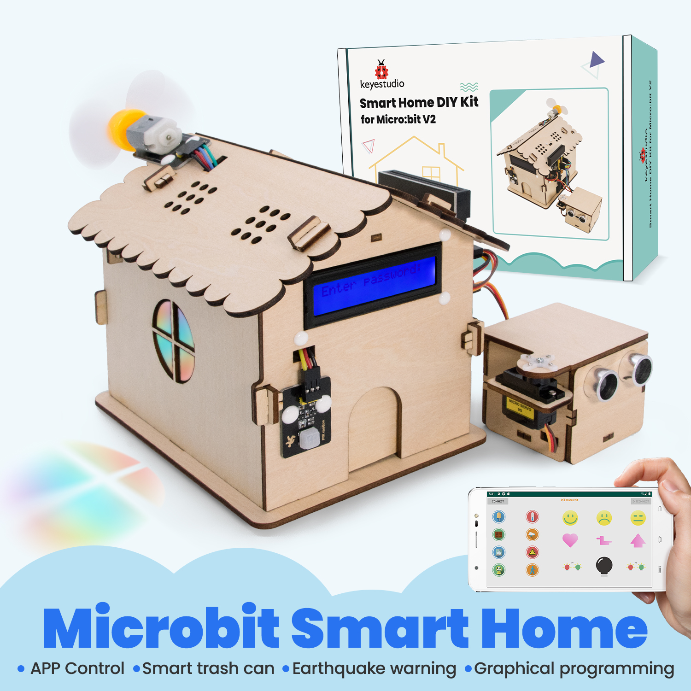

---

## Kit List

**Please check the list to ensure that all parts are intact. If you find missing ones, please contact our sales staff immediately.**

| #    | PIC                                   | NAME                                                         | QTY  |
| ---- | ------------------------------------- | ------------------------------------------------------------ | ---- |
| 1    | 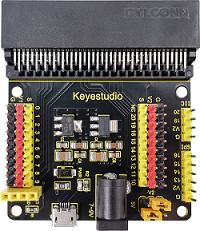             | Micro:bit sensor V2 expansion board                          | 1    |
| 2    | 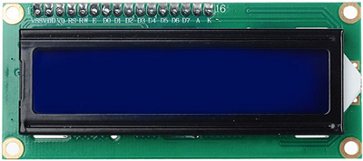             | I2C 1602 LCD                                                 | 1    |
| 3    | 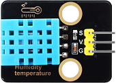             | XHT11 temperature and humidity module (compatible with DHT11) | 1    |
| 4    | 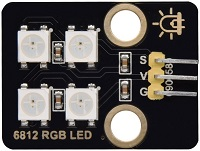             | 6812 RGB module                                              | 1    |
| 5    | 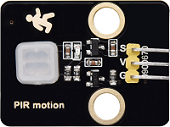             | PIR motion sensor                                            | 1    |
| 6    | 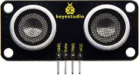             | SR01 ultrasonic sensor V3 (CS100A solution)                  | 1    |
| 7    | 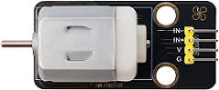 | 130 motor                                                    | 1    |
| 8    | 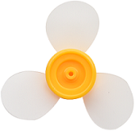         | fan                                                          | 1    |
| 9    | 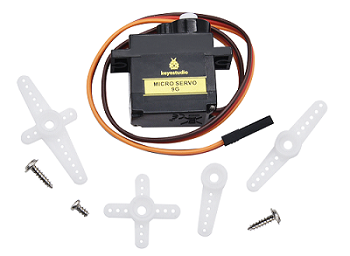         | 180 degree servo                                             | 2    |
| 10   | 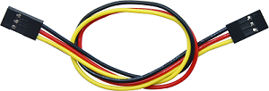                 | 3pin F-F DuPont wire 150mm (black-red-yellow)                | 3    |
| 11   |                  | 3pin F-F DuPont wire 200mm (black-red-yellow)                | 2    |
| 12   | 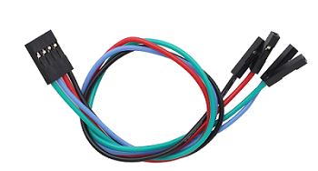                 | 4pin F-F DuPont wire 200mm (black-red-blue-green)            | 4    |
| 13   | 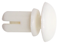               | R4060 push type nylon rivet                                  | 10   |
| 14   | 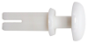               | R3075 push type nylon rivet                                  | 6    |
| 15   | 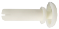               | R3100 push type nylon rivet                                  | 6    |
| 16   | 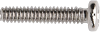           | M2*10MM round head screw                                     | 6    |
| 17   | 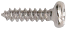         | M1.4*6MM round head self tapping screw                       | 6    |
| 18   |                      | M2 nut                                                       | 6    |
| 19   | 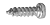         | M1.2*4MM round head self tapping screw                       | 6    |
| 20   | 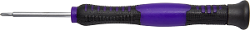   | Phillips screwdriver                                         | 1    |
| 21   | 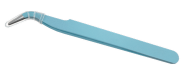           | curved tweezer                                               | 1    |
| 22   | 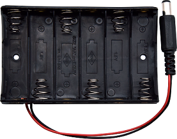             | battery holder                                               | 1    |
| 23   | 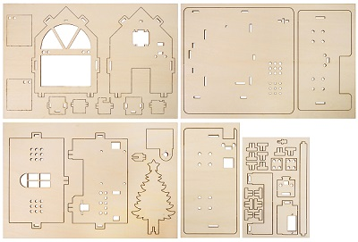                 | bass wood board                                              |      |

---

## Introduction

This smart home made of basswood not only looks exquisite and beautiful, but also has a wealth of built-in smart home functions. So children can experience the charm of technology. For example, password door cultivates children’s logical thinking, temperature sensing fan lets them feel the practicality of technology.

The kit comes with programming tutorials and experiments. Children can learn to program to conduct interesting scientific exploration, and gain knowledge and fun at the same time.

Besides, it integrates creative design, smart technology and fun education, making it a quality product ideal for young children. It can not only attract children's interest, but also cultivate their hands-on ability and innovative thinking, and inject a steady stream of motivation for their growth.

---

## Features

Designed for five or six years old, this kit not only provides a safe and fun learning environment for children, ‌but also guides them through learning to code in an edutainment way, which develops their creativity and logical thinking skills.

1, makecode graphical programming

2, simple assembly

3, interesting projects

4, raw wood-color basswood board for DIY painting

5, rich expansion interfaces and mounting holes

---

## Expansion Board

### Description

In the education market, micro:bit control boards are becoming increasingly popular. However, a single micro:bit board is not easily tested against other sensors. We specially designed this HolaSmart expansion board for the micro:bit.

The sensor expansion board splits all I/O ports into 3-PIN interfaces (GND, VCC, Signal) for easy connection to the micro:bit control board and other sensor modules.

In addition, it extends some commonly used serial communication interfaces to pins or female headers with pin spacing of 2.54mm, such as I2C and SPI communication pins. Therefore, this expansion board enables communication between the micro:bit board and other communication devices.

You can power the micro:bit board through the yellow DC jack (DC 7-9V) or micro USB port (DC 5V) on the expansion board.

When powering the sensor, you can select the power supply voltage of 3.3V or 5V through the jumper cap V1 and V2.

**ATTENTION:**

**When a external sensors is connected to the expansion board, the working current of the AMS1117-3.3V and NCP1117ST50T3G chips is too large so is easy to heat. Special care should be taken to avoid contact with the two chips to avoid burning out.**

### Features

\- Input voltage: Black DC jack (DC 7-9V) or micro USB interface (DC 5V)

\- Output voltage: 3.3V or 5V via jumper cap V1/V2

\- Comes with power indicator

\- Split the PIO port of the micro:bit into a 3-pin interface

\- Serial communication pin

\- I2C communication pin

\- SPI communication pin

\- Overall dimensions: 65mm x58mm x12mm

\- Weight: 31 g

### Pin-out

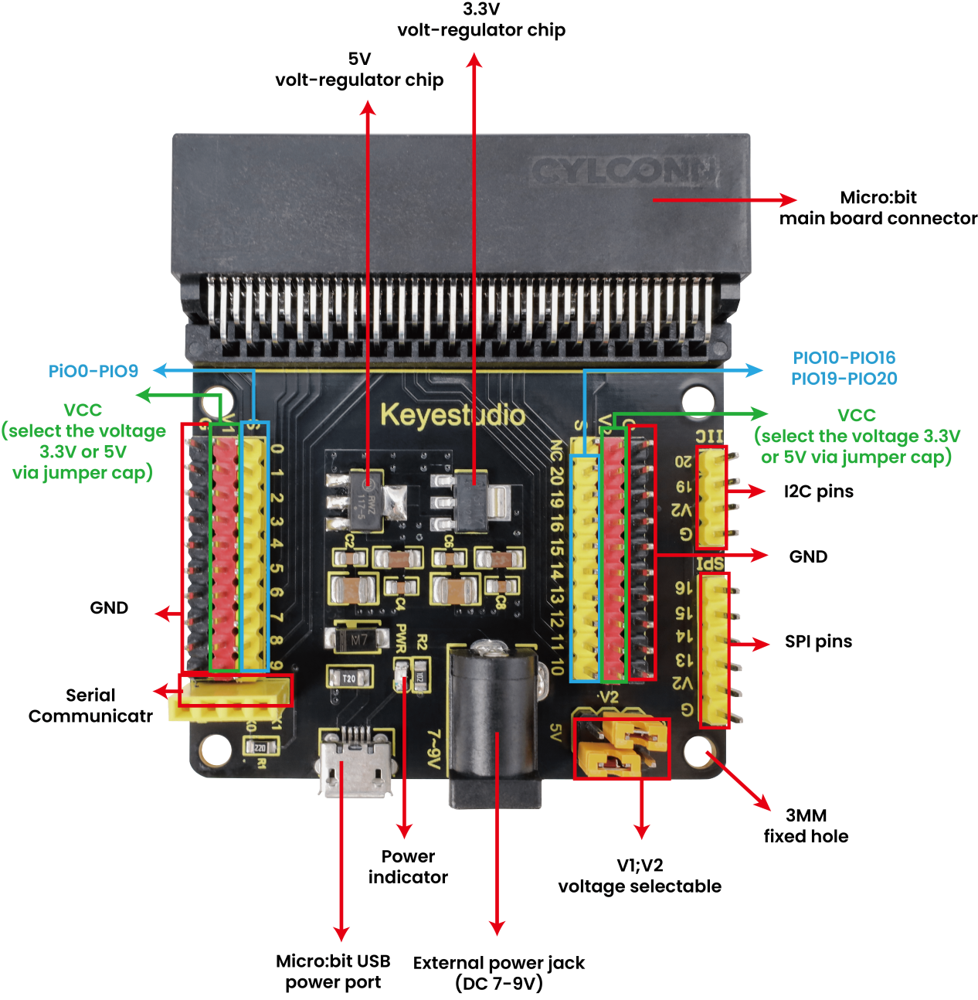

| Picture           | V1 Interface voltage/v | V2 Interface voltage/v |
| ----------------- | ---------------------- | ---------------------- |
| 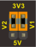 | 3.3                    | 3.3                    |
| 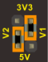 | 3.3                    | 5                      |
| 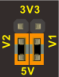 | 5                      | 5                      |
|  | 5                      | 3.3                    |

---

